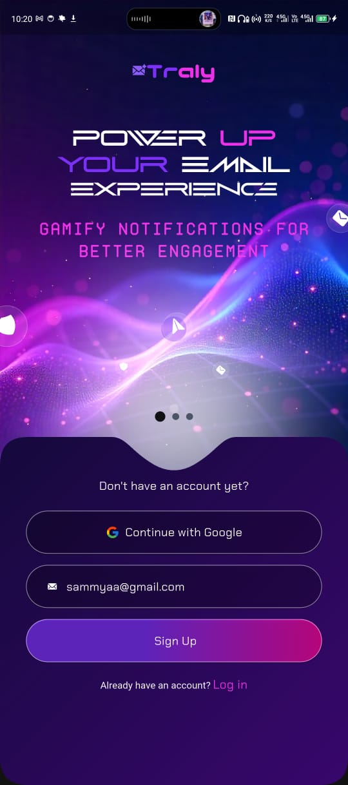
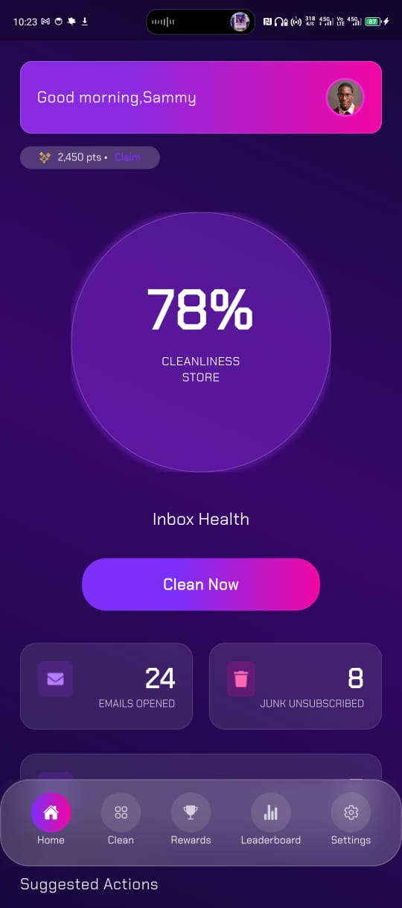
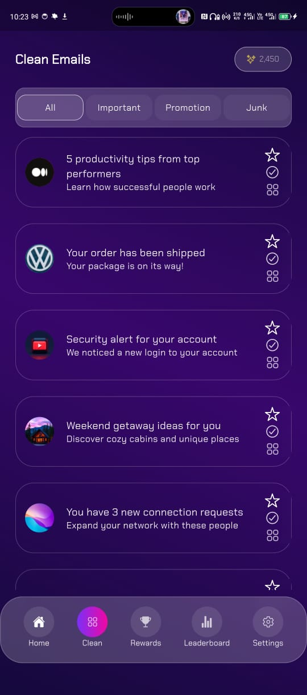
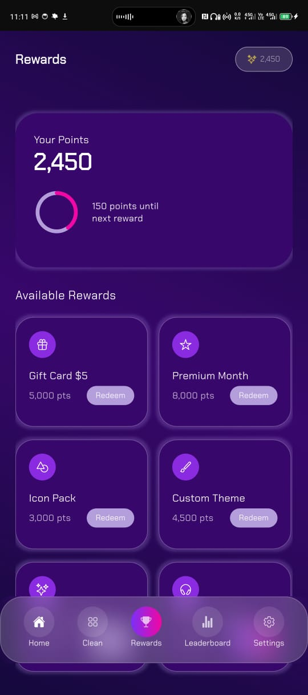
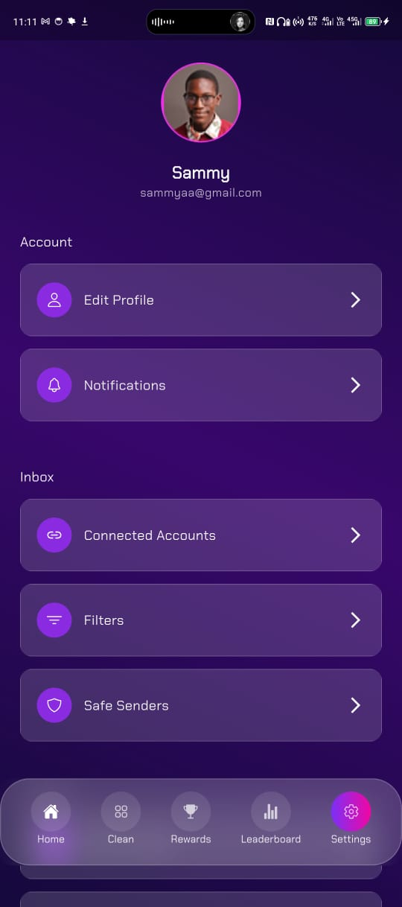
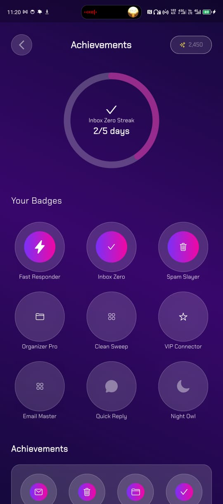

# Traly — Flutter Project  

## ⚡ Framework  
This project is built using **Flutter** , Google’s open-source UI toolkit for building high-performance, natively compiled applications for mobile, web, and desktop — all from a single codebase.  

Traly leverages Flutter’s **fast development cycle (hot reload)**, expressive UI, and a rich ecosystem of packages to deliver a modern, scalable app with clean architecture.  

---

## 📦 Project Structure Overview  
The app adopts a **feature-oriented modular design**, ensuring that each module is self-contained, reusable, and easy to extend.  

TRALY/
├── android/                    # Android-specific configuration
├── ios/                        # iOS-specific configuration
├── assets/                     # Images, icons, vectors, fonts
│ ├── icons/
│ ├── images/
│ └── vectors/
├── fonts/                      # Custom fonts
├── lib/
│ ├── gen/                      # Auto-generated files (flutter_gen)
│ └── src/
│ ├── app/                      # Global app setup (router, providers, theme, constants)
│ ├── features/
│ │ └── bottom_navigation/
│ │ ├── controller/             # Riverpod controllers, business logic
│ │ ├── pages/                  # Page content (Home, Rewards, Settings, etc.)
│ │ ├── screens/
│ │ ├── views/                  # UI building blocks (e.g. BottomNavBar)
│ │ └── widgets/                # Reusable widgets (cards, tiles, etc.)
│ └── clean/                    # (Future features)
└── pubspec.yaml # Dependencies & metadata

yaml
Copy code

---

## 🚀 Getting Started  

1. Ensure **Flutter**  and **Dart**  are installed.  

2. Install dependencies:  

```
flutter pub get
```

3. Run the project:

```

flutter run
```

   Run on specific platforms:

```
bash

flutter run -d android

flutter run -d ios
```

##  🧠 Architecture Highlights
### Each feature is organized into:

- **controller/** → Riverpod providers & state controllers


- **pages/** → Core page contents (per bottom navigation tab)

- **screens/** → Screens combining UI + state

- **views/** → Stateless UI views (navigation, layouts)

- **widgets/** → Reusable UI components

##  🔁 State Management — Riverpod
Uses **StateProvider**, **Notifier**, and **AsyncNotifier** for state control.

No **BuildContext** dependency inside business logic.

Decoupled, testable, and reactive state handling.

##  🧭 Navigation — GoRouter
Navigation is powered by **GoRouter**.

Provides clean, declarative route definitions.

Enables nested navigation and deep linking.

Easier to scale compared to Navigator 1.0.

##  🎨 Styling & Responsiveness

- Typography: Implemented using google_fonts for a modern, sleek look.

- Colors: Centralized in alpha_colors.dart for consistency.

- Spacing & Durations: Defined in constants.dart for reusability.

- Responsive UI: Built with flutter_screenutil for consistent scaling across devices.

##  📁 Assets & Icons
Assets are defined in pubspec.yaml.

Organized into:

- icons/ → App icons, tab bar icons

- images/ → Static images

- vectors/ → SVGs

flutter_gen is used for safe, auto-generated asset references.


##  ✅ Completed Features

### 🏠 Clean / Emails Page  
- Scrollable email boxes
- Fliter for the emails (Important, Promotions & Junk) 

### ⚙️ Settings  
- Centralized screen for app, rewards and account options.  
- Clean, minimal layout with reusable setting tiles.  
- Supports navigation to sub-pages, and future extensibility.  


### 📱 Bottom Navigation
Built from scratch (custom implementation, not default BottomNavigationBar)


##  📋 Final Notes

### This codebase is designed to be:

- **Scalable** → feature-first modular structure

- **Clean** → no business logic inside widgets

- **Reusable** → shared UI components and styles

- **Responsive** → adaptive layouts for multiple devices


## 📸 Screenshots  

| Onboarding | Home | Emails |
|------------|------|--------|
|  |  |  |

| Rewards | Settings | Achievements |
|---------|----------|--------------|
|  |  |  |


For questions or suggestions, reach out via [GitHub issues] (https://github.com/TralyICP/traly-mobile/issues).